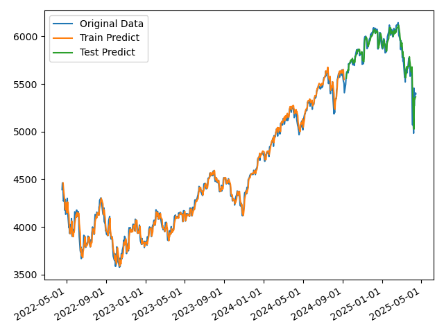
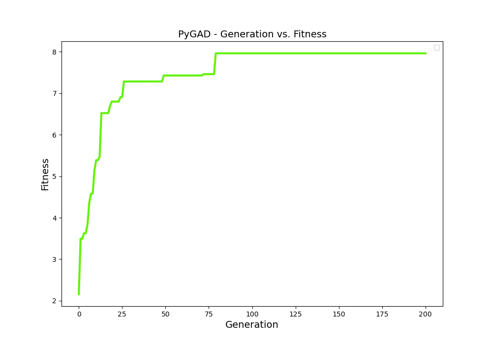

# Optymalizacja portfela akcji w celu maksymalizacji zysków w skali 1 dniowej.


## Cel projektu

Celem projektu jest wybór 10 spółek będących częścią indeksu S&P 500 których zakup przyniesie największy zysk w 
skali jednego dnia. Przyjęto założenie wykonywania transakcji po cenach zamknięcia oraz inwestycje równej kwoty w 
każdą firm. Selekcja zostaje wykonana za pomocą algorytmu genetycznego, wykorzystującego mn. sieć LSTM. Ceny akcji 
zostały pobrane za pomocą biblioteki yfinance a indeksy spółek wchodzących w skład analizowanego indeksu z wikipedii.

## LSTM

Do treningu sieci LSTM wykorzystano historyczne wartości zamknięcia indeksu S&P 500 z pierwszych 80% ostatniego roku.
Pozostałe 20% stanowiło zbiór testowy. Takie podejście pozwala wytrenować sieć zdolną do predykcji cen 
poszczególnych spółek, bez konieczności uczenia osobnego programu dla każdej firmy.

### LOOK_BACK
Przetestowano sieci LSTM o różnym look_back i najlepiej sprawdza się look_back=3

Nauka i test sieci na indeksie S&P 500.



Test powyższego LSTM na cenach akcji spółki Cisco Systems, Inc.


[//]: # (#### LOOK_BACK = 3)

[//]: # ()
[//]: # (Nauka i test sieci na indeksie S&P 500.)

[//]: # ()
[//]: # (![lstm_plot1.png]&#40;./docs/plots/lstm_plot3_16.png&#41;)

[//]: # ()
[//]: # (Test powyższego LSTM na cenach akcji spółki Apple Inc.)

[//]: # ()
[//]: # (![AAPL_predicted_prices1.png]&#40;./docs/plots/AAPL_predicted_prices3.png&#41;)

[//]: # ()
[//]: # (Z eksperymentu wynika że biorąc pod uwagę 3 ostatnie notowania predykcja jest znacznie dokładniejsza. Z tego powodu )

[//]: # (w dalszej części sprawozdania rozważamy LOOK_BACK = 3)

[//]: # ()
[//]: # (Analizowany przykład AAPL obrazuje fakt że AI nie radzi sobie z nagłymi skokami wartości.)

## Algorytm genetyczny

W celu zmniejszenia czasu działania programu algorytm liczy przewidywane ceny akcji zamknięcia kolejnego dnia każdej 
spółki tylko raz.

### Funkcja fintess

Za najlepsze spółki uznajemy takie które w ostatnim miesiącu notowały najwyższy wzrost przy najniższym ryzyku oraz 
prognozują wzrost w dniu kolejnym.

```python
def fitness_func(ga_instance, solution, solution_idx):
    portfolio, portfolio_tickers = portfolio_generate(df_final, solution)
    ret = portfolio_history_return(portfolio)
    ris = portfolio_risk(portfolio)
    expected_return_points = (portfolio_LSTM_return(portfolio_tickers) - 1) * 500
    fitness = (ret / ris) + expected_return_points
    return fitness
```

### Trening algorytmu



## Test programu
### Test 1

Test został przeprowadzony w dniu 13.06.24 po zamknięciu NYSE oraz NASDAQ na których notowane są spółki wchodzące w 
skład S&P 500. 

Dzienne zmiany zmiany cen na giełdzie są dosyć małe dlatego przyjęto założenie że 12.06.24 zainwestowano po cenach 
zamknięcia po 100$ w spółki wskazane przez program:

PGR, FIS, VST, NVDA, NRG, LDOS, NVDA, LLY, QCOM, NRG.

W takim przypadku zysk wyniósł 5.77$.

Gdyby ten sam 1000\$ zainwestować po równo we wszystkie spółki w tym indeksie strata wynosiłaby 2.8$.

### Test 2

Test został przeprowadzony w dniu 14.04.25 po zamknięciu giełdy.

Spółki wskazane przez program:
TJX, NEM, MKTX, HUM, MKTX, DRI, COR, UNH, LW, HUM

Strata na wskazanych spółkach: 0.198%

Średnia strata indeksu: 0.369%

### Źrodła

- <https://pypi.org/project/yfinance/> Dokumentacja yfinance

- <https://www.danyelkoca.com/en/blog/optimal-stock-portfolio-with-genetic-algorithm>
